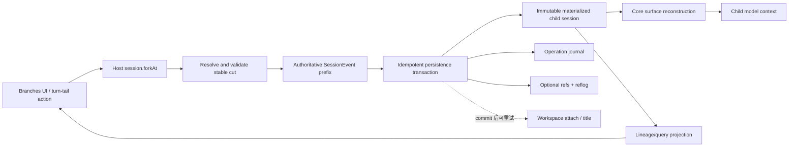

# DSH 会话版本树：机制审计与安全设计

> 状态：Phase 1 已实现并通过隔离 DSH Web 验收
> 日期：2026-08-14
> 审计基线：DeepSeek Harness `47f943859bef60e4160492346772ded9b24f765a`（`master`，源码 `0.1.0-rc.5`；npm `next` 为 `0.1.0-rc.6`）
> 工作原则：原会话不可变、失败可恢复、卸载不损坏、上下文可证明、外部副作用不伪装成已回滚。

## 1. 结论先行

这个方向可行，而且 DSH 已经有一个比预想更好的底座：它不是把聊天 UI 当作真相，而是把 `SessionEvent` 事件日志作为权威记录；现有 Host 和客户端也已经实现“在完整 turn 后 fork 为新会话”。因此，不应该重新造一套 Git 数据库，更不应该改写原会话。

推荐产品定义是：

- **Git-like 交互，DSH-native 存储**：用户看到树、分支名、从某个对话节点继续，但底层仍使用 DSH 的不可变 session + fork lineage。
- **回溯永远创建 child**：不提供会改写父会话的 reset/checkout；原路径继续存在。
- **上下文按 child 的 seed 重建**：child 只继承 cut 之前的事件前缀，再由 DSH 的 surface/compaction 规则计算模型上下文。
- **先做只读树视图，再做事务性版本能力**：现有公共 API 可以安全支撑树视图和基本 fork，但还不足以承诺幂等、跨进程一致的 Git 式版本系统。
- **AI 文本已经保留，文件不是**：assistant 文本、chunk、工具调用/结果已在 session log 中；工具写出的任意文件、网络请求、邮件、支付等不随对话分支回滚。

最稳妥的 v1 是“不可变、完整物化的 child session”，暂不做 merge/rebase/cherry-pick、共享前缀 delta、文件系统回滚和自动 GC。

## 2. 范围与非目标

### 2.1 v1 范围

1. 展示 session lineage 树，并区分普通用户分支与 subagent 子会话。
2. 允许从一个已完成 turn 创建新 child。
3. 打开 child 后继续对话；父会话不受影响。
4. 清晰展示分叉点、父子关系、标题、创建时间和当前所在节点。
5. 异常 lineage 只读展示并告警，不自动修复。
6. 插件卸载后，所有 session 仍可由原生 DSH 读取和继续。

### 2.2 明确不做

- 不改写、截断、覆盖父 session log。
- 不在 open turn、运行中的 tool、未闭合 compaction 内 fork。
- 不把 projection、UI state 或缓存作为版本真相。
- 不声称对话分支会撤销文件、进程、网络或外部服务副作用。
- 不自动重放结果未知或非幂等工具。
- 不做自动 merge/rebase/cherry-pick。
- 不把 raw session log 存进真正的 Git 仓库，也不自动 commit/push。
- 不在没有完整可达性证明、宽限期和备份时删除 session 或 artifact。
- 不为插件元数据写入“卸载后无法识别”的 required 自定义 SessionEvent。

## 3. 已核实的 DSH 机制

### 3.1 权威数据：append-only SessionEvent

`SessionEvent` 是 lossless JSON、连续 `seq` 的 append-only source of truth。seed/load 会验证事件序列和 surface transition；live append 会先验证、再提交并冻结事件。核心证据：

- `packages/core/session/src/types.ts:230-435`
- `packages/core/session/src/index.ts:417-655`
- `docs/architecture.md:92-96`

这意味着“轨迹”不能被当成另一份 session log；它只能是事件日志的投影。

事件本身没有全局 UUID，稳定事件地址只能是 `(sessionId, seq)`。fork 会按值复制整个 prefix，因此 message id、tool call id、compaction id 等内部 id 可能在父子 session 间重复；跨树索引不能把它们当作全局唯一键：

- `packages/core/session/src/types.ts:404-435`
- `packages/core/session/tests/fork.spec.ts:79-103`

### 3.2 模型上下文：surface，不是 raw log

模型看到的是由事件日志派生的 surface。compaction 的 replacement 会遮蔽旧 surface 节点，但原始事件仍留在 raw log 中：

- `packages/core/session/src/index.ts:708-746`
- `packages/core/session/src/surface.ts:184-243`
- `packages/core/session/README.md:92-109`

所以从不同 cut 分支时，必须用该 cut 的真实事件前缀重新投影；不能拿“当前 UI 显示的消息”或“最新 surface”倒推历史上下文。

### 3.3 Trajectory：浏览器投影，不是日志

`ui-trajectory` 注册 target-specific definition、trajectory view 和 UI tab，本身不拥有持久化服务，也不改变 Chat 或模型上下文：

- `packages/client/ui-trajectory/README.md:1-8`
- `packages/client/ui-trajectory/src/client/index.ts:22-64`
- `packages/client/ui-trajectory/src/client/trajectory-contract.ts:16-68`
- `packages/client/ui-trajectory/src/client/trajectory-record.ts:36-109`

因此，用户从 trajectory 中点击一个位置时，插件必须把该 UI record 解析回稳定的 session event/turn boundary，而不能复制 trajectory cell。

当前 trajectory 没有 record/action child slot，外部插件不能安全地给每一行直接加按钮。`conversation.chat.turnTail` 又是独占 chain，常驻分支操作会遮蔽 Produced Files 等现有贡献。因此实现只注册独立 `conversation.view`，在视图内列出 loaded completed turns；trajectory 行内操作需要后续由上游增加 additive action slot。

### 3.4 已有 fork

Core 已有 `SessionStore.fork(source, boundary?, childId?)`：复制 source 的稳定前缀，并在 child header 写入 `parentSession` 和 `seedLength`。它拒绝 open-turn boundary：

- `packages/core/session/src/index.ts:1067-1153`
- `packages/core/session/tests/fork.spec.ts:63-319`
- `packages/core/session/README.md:15-17,139-143`

Host 已暴露 `session.fork({ sessionId, atSeq? })`，并可读取 cold persisted source。`atSeq` 会映射到其所在 turn 的首个 `turn/end`，还会带上该 turn 后、下一 turn 前的 log-only 事件：

- `packages/host/apiproxy/src/api/sessions.ts:323-338`
- `packages/host/apiproxy/src/api-proxy.ts:2363-2459`

客户端已经在 completed turn 的 assistant tail 提供“在新对话中分支”：

- `packages/client/ui-conversation/src/client/chat/TurnTailNodeView.tsx:35-47`
- `packages/client/ui-conversation/src/client/apply.ts:417-422`
- `packages/client/runtime/README.md:73-75`

这项提案应扩展现有 fork，而不是另建平行机制。

### 3.5 已有 lineage 查询

Session summary 已暴露 `parentSessionId`；客户端有 fail-soft lineage flattening；`session-query.traceSession()` 会返回祖先和确定性的递归后代，并识别 orphan/cycle：

- `packages/host/apiproxy/src/api/sessions.ts:176-202`
- `packages/client/runtime/src/client/sessions/lineage.ts:49-93`
- `packages/session-query/session-query/src/index.ts:272-283`
- `packages/session-query/session-query/src/tracing.ts:107-172`
- `packages/session-query/session-query/README.md:9-18`

数据库中的 `parent_session` 目前不是外键，所以树视图必须把 orphan/cycle 当作可能输入，而不是假设图永远正确。

### 3.6 持久化与已知边界

持久化 coordinator 会在单进程内按 session id 串行化操作；SQLite batch 使用事务，JSONL 首次 materialization 和 append 有 crash-safe 措施。但当前合约不提供跨进程 writer exclusion/CAS：

- `packages/session/session-persistence/src/coordinator.ts:663-710,891-985`
- `packages/session/session-persistence/README.md:51-59`
- `packages/session/session-persistence-jsonl/README.md:70-77`
- `packages/session/session-persistence-sqlite/src/index.ts:278-338`
- `packages/session/session-persistence-sqlite/README.md:56-61`

现有 Host fork 会创建随机 child id，且返回前没有显式 child durability barrier。workspace attach 和随后 title rename 还存在已设计的 partial-success 语义：

- `packages/host/apiproxy/src/api-proxy.ts:2415-2458`
- `packages/client/runtime/src/client/sessions/manager.ts:571-603`
- `packages/client/runtime/src/client/sessions/service.ts:500-531`

这是一个需要故障注入确认的**耐久性风险**，不是本审计已复现的数据丢失 bug。生产版本必须先关闭这个证明缺口。

### 3.7 插件兼容性约束

未知事件只有带 `ignorable: true` 才能被旧 reader 跳过；缺失该标记意味着 required，无法识别时会拒绝整个 session。当前普通 append 接口也没有适合外部插件随意写入该 envelope 标记的稳定契约：

- `packages/core/session/src/types.ts:404-435`
- `packages/core/session/src/index.ts:550-633`
- `packages/core/session/README.md:81-83,141-143`
- `packages/session/session-persistence/src/coordinator.ts:1046-1065`

所以 v1 不把 branch name、UI layout 等可卸载元数据写成自定义 SessionEvent。权威 lineage 继续使用 core 已认识的 `parentSession/seedLength`；额外 refs/reflog 应放在独立、版本化 side store 中。

### 3.8 外部插件的安装与 UI 边界

DSH 的正式树外分发单位是 bundle。包可在 `package.json` 声明 `dsh.bundle.patch`，并同时导出 Node half 与 `./client` browser half；通过 `dsh plugin --profile <name> add <package>` 加入 profile：

- `docs/architecture.md:17-27`
- `docs/user/develop/basic/publish.md:1-178`
- `apps/cli/src/plugin.ts:47-112`
- `packages/client/modules/src/index.ts:46-59,332-419`

外部 MVP 可使用的 additive slots：

- `conversation.view`：独立分支树 Tab。
- `conversation.chat.turnTail`：历史 completed-turn 分支按钮，owner 自带 `seq`。
- `conversation.session.header.actions`：当前 session 的分支/树操作。
- `sidebar.footer.action`：全局入口（如果确有需要）。

证据位于 `packages/client/ui-conversation/src/client/contract/slots.ts:53-112,316-341` 和 `packages/client/ui-sidebar/src/client/contract/slots.ts:31-35`。

外部 MVP 不应 shadow 整个 `sidebar.workspaces` 或内建 trajectory；那会让插件承担完整原生 UI 的责任。`session.list` 当前只暴露 `parentSessionId`，没有暴露 `seedLength/resolvedBoundarySeq`，所以它能画树，却不能廉价、精确地标注分叉 seq；一等实现应扩展 summary/fork response，而不是让浏览器加载每个 child 全日志来猜。

静态 browser plugin 目前没有完整的在线 unload/roster 更新链。安全运维约定是：插件 add/remove 后重启 DSH 并刷新页面，不承诺当前页面内热安装/热卸载：

- `packages/client/runtime/README.md:89-93`
- `packages/client/web/src/boot.tsx:185-207`
- `packages/client/modules/src/index.ts:184-191`

## 4. 建议的语义模型

### 4.1 对象

| 概念 | v1 表示 | 是否权威 |
|---|---|---|
| 会话节点 | `SessionId` | 是 |
| 分支边 | child header 的 `parentSession` | 是 |
| 继承长度 | child header 的 `seedLength` | 是 |
| 用户点击位置 | `{ sessionId, requestedSeq }` | 否，只是请求 |
| 实际分叉点 | `{ sourceSessionId, resolvedTurnEndSeq }` | 是，需由 Host 返回 |
| 模型上下文 | child seed 经 core surface 规则投影 | 是，可重建 |
| 分支显示名 | 现有 session title；未来可加 side-store ref | 派生/可恢复 |
| 树布局 | client projection/cache | 否 |
| AI 文本 | raw session events | 是 |
| 文件 artifact | immutable content-addressed blob + event/ref | 可选二期 |

### 4.2 用户操作

- **Branch from here**：从所选 completed turn 创建新 child，并打开 child。
- **Go to node**：仅切换查看/继续哪个 session，不移动或改写任何历史。
- **Rename**：只改变显示标题或未来的 named ref，不改变 session id、parent 或 seed。
- **Archive**：从默认列表隐藏；v1 不 hard delete。
- **Restore**：取消 archive。

“回到这里”在产品文案中必须解释为“从这里创建新分支”，不能使用会暗示原会话被重置的措辞。

### 4.3 上下文构造

```text
source raw log[0..resolvedCut]
  -> 验证 seq / turn / bracket / provenance
  -> 作为 child seed 完整复制
  -> core 重建 child surface
  -> compaction/replacement 按 cut 时状态生效
  -> 后续 child events 只追加到 child
```

父会话 cut 之后的消息仍保存在父节点，但不会进入 child 的模型上下文。没有隐式 merge，也没有“从另一个分支自动找回信息”。如未来提供摘取功能，应是用户显式操作，并写成普通、可见、可审计的 model-visible 事件。

### 4.4 继承边界

child 应继承 raw prefix、cwd、agent preset/composition、最新模型路由，以及 prefix 中已有的 immutable attachment/spill locator；surface、request fold 和 projection 必须在 child 上重建，不能复制父 cache。

child 不应继承 live inbox、queued steering、abort signal、活动 tool/process、审批等待、定时器或进程内 background job。现有 goal/schedule 也有 seed-boundary 语义：日志状态可以存在，但 fork 后不会擅自重新激活父会话的目标或提醒；message feedback 是 session-identity sidecar，不自动复制。

相关证据：

- `packages/host/apiproxy/README.md:41`
- `packages/jobs/jobs/README.md:36`
- `packages/goal/goal/README.md:24`
- `packages/schedule/schedule/README.md:17`
- `packages/feedback/message-feedback/README.md:26`
- `packages/spill/spill/README.md:25`

## 5. 建议架构



分层原则：

1. Session log 和 child header 是对话历史的权威事实。
2. operation journal 负责网络重试幂等。
3. refs/reflog 只负责人类可读的分支指针和恢复记录，不取代 session lineage。
4. query、projection、tree layout、workspace membership、title 都是可重建或可重试的派生状态。
5. artifact store 独立于 session store，引用只有在 blob durable 后才可发布。

## 6. 两级实现边界

### Level A：安全的只读树 + 现有 fork（可先做原型）

只使用现有稳定语义：

- 从 session summaries/lineage helper 构造树。
- 注册独立 `conversation.view` 和 `conversation.chat.turnTail` action；不修改 trajectory 行。
- 调用现有 `ISessions.fork({ sessionId, atSeq, increaseTitle: true })`。
- 不写 custom SessionEvent，不维护独立权威历史，不删除数据。
- 对 partial success 做显式提示并刷新树。
- 请求 pending 时禁用重复点击；超时或未知结果不盲目自动重试，而是先刷新 lineage 查找 partial success。
- 插件装卸后 session 仍是普通 DSH session。

这个 Level 可以验证交互价值，但必须标为 developer preview；它不能宣称拥有强幂等 fork、named ref CAS 或跨进程一致性。

### Level B：可称为版本系统的生产能力（实现前必须补齐）

需要在 Host + persistence capability 边界新增原子或可恢复的 `forkAt`：

```ts
type ForkAtRequest = {
  sourceId: SessionId
  expectedSourceRevision: number
  cutSeq: number
  cutEventHash: string
  operationId: string
  childId: SessionId
  ref?: {
    name: string
    expectedGeneration: number
  }
}
```

最低事务语义：

1. 关闭 source mutation admission 或取得等价 barrier。
2. flush source。
3. 在同一个稳定 observation 中取得 prefix、revision/incarnation 与 cut hash。
4. 验证 completed turn、surface、bracket、graph 和权限不变量。
5. durable 写入 child header + 完整 copied events。
6. durable 写入 `operationId -> result`；可选地 CAS 更新 ref，并 append reflog。
7. commit 后才向 live store/UI 发布成功。
8. workspace attach/title 是 commit 后的可重试 saga；失败保留 durable child，不自动删除。

SQLite 应在一个条件事务中校验 source revision、插入 child/events、记录 operation result、CAS ref、追加 reflog。JSONL 若要支持同等语义，需要 repository-level writer lock、私有 transaction journal、fsync/no-overwrite publish、generation CAS 和 crash recovery；仅靠当前公共插件 API 拼接多个调用不够安全。

## 7. 必须成立的安全不变量

1. 父 log 永不被 branch、open、rename、archive 操作改写或截断。
2. cut 只能落在完整 `turn/end` 后，并按协议处理该 turn 后的 log-only 事件。
3. child seed 与已验证的 source prefix 规范等价；`seedLength`、cut seq/hash/revision 一致。
4. 同一个 `operationId` 永远映射到同一个 child/result；同 id 不同 payload 必须拒绝。
5. source 在观察与提交间改变时返回 `STALE_SOURCE`，不能悄悄改用“最新 turn”。
6. named ref 更新使用 `expectedGeneration` CAS；冲突返回 `STALE_REF`。
7. child 未达到 durable commit point 前不向用户报告成功。
8. workspace attach/title 失败不回滚或删除已提交 child；返回可恢复的 partial success。
9. 父缺失、自父、循环、超深 lineage 在新写入时拒绝；旧异常数据 quarantine/read-only。
10. projection/cache/UI tree 永远不是唯一权威。
11. 对话分支不声称回滚工具和外部副作用。
12. 未知 schema/version fail closed。
13. 插件卸载不影响 session replay/resume。
14. artifact 必须先 durable、后引用；读取时校验 hash/metadata。
15. 没有完整 root-set mark、lease、宽限期和二次确认时，不 hard delete。

## 8. 故障语义

| 故障点 | 必须看到的结果 | 禁止行为 |
|---|---|---|
| source flush 失败 | fork 失败，无 child success | 用内存尾部冒充 durable prefix |
| child commit 前崩溃 | 重启后无可见 child，或 journal 幂等 roll-forward | 半个可继续的 child |
| child 已提交、响应丢失 | 同 operationId 重试返回同 child | 创建重复 children |
| workspace attach 失败 | 返回 committed child id + retryable 状态 | 删除 child 或谎报全失败 |
| title rename 失败 | child 保留，树可发现，rename 可重试 | 重复 fork |
| source 并发 append | 成功绑定原 revision，或 `STALE_SOURCE` | 静默改变 cut |
| ref 并发更新 | 一个成功，其他 `STALE_REF` | last-write-wins 覆盖 |
| disk full / SQLite busy | 原子失败、可重试、无损父会话 | 部分写后报告成功 |
| JSONL torn tail | 按现有 repair/quarantine 协议处理 | 猜测或静默裁剪 committed history |
| lineage cycle/orphan | partial/quarantined read-only UI | 自动改 parent |
| tool/call 无 result | 显示 outcome unknown | 自动重放工具 |
| 插件被卸载 | 原生 session 仍可读取 | 因缺少插件而拒绝整个 log |

## 9. AI 产物与附件

需要把三类“保留”分开：

1. **对话文本**：已经在 raw SessionEvent 中保留；fork 会复制 cut 前前缀。
2. **原生 attachment**：现有 image attachment 已使用 SHA-256 CAS，并在保存后才允许 model-visible event。fork 可共享 immutable blob 引用。
3. **任意工具产物**：工作区文件、音视频、构建产物和远程对象不自动属于 session 版本。

还需要单独处理“正在生成但尚未完成”的 assistant 内容。`assistant/chunk` 是 audit/UI 数据，只有成功结束后组装出的 `assistant/message` 才进入模型 surface；当前也没有 per-chunk durability checkpoint。因此，v1 只能从 closed turn 分支。若用户要保留半截生成，应先显式取消/结束并让 turn 按修复协议闭合，或以后设计非 model-visible stash sidecar；绝不能把半截 chunk 自动提升成 assistant message。

证据：

- `packages/attachment/attachment/README.md:5-21`
- `packages/attachment/attachment-local/src/store.ts:129-230`
- `packages/core/agent-loop/src/agent.ts:332-365`
- `packages/session/session-checkpoint-policy/README.md:39-43`

如果二期需要“暂存 AI 生成文件”，应新增独立 artifact catalog：

```text
artifact = {
  tenantScopedObjectId,
  sha256,
  bytes,
  mediaType,
  createdAt,
  producer: { sessionId, eventSeq },
  encryptionKeyVersion?
}
```

原则：immutable、租户/工作区隔离、显式 pin/unpin、默认不自动 GC、分支只共享引用、不自动注入模型上下文。跨用户全局 dedup 可能泄露“某秘密是否存在”，不采用。

如果未来需要工作区版本快照，应作为独立、显式授权的 workspace-VCS 功能；必须向用户展示 diff/范围，并且绝不自动 commit、push 或把远程副作用说成已回滚。

## 10. 测试与验收矩阵

### 10.1 Unit / property

- 任意 `atSeq` 到 resolved `turn/end` 的映射。
- turn 后 log-only 事件的固定继承规则。
- compaction replacement 前、中、后 cut 的 surface。
- seq 缺失、重复、乱序；provenance 不合法。
- open turn/tool/bracket 拒绝。
- self-parent、cycle、orphan、超深树。
- 同 opId 重放；同 opId 不同 payload 拒绝。
- stale source/ref CAS。
- artifact hash、metadata、reachability 和两代 GC。

### 10.2 Integration

- live source 与 cold persisted source。
- JSONL 和 SQLite 两种 backend。
- root、普通 branch、subagent lineage 混合树。
- attachment 引用、compacted session、大 seed。
- 插件卸载/重装后 replay/resume。
- workspace attach、title rename 的 partial success。

### 10.3 并发与故障注入

- fork 与 append/compaction/flush/dispose/unload 竞态。
- 同 source 双 fork、同 branch name、同 generation、同 opId 双请求。
- source 在 read/commit 间变化。
- SQLite busy/disk-full/constraint rollback。
- JSONL 在 journal prepare、child publish、ref publish、commit marker、每次 fsync 前后 SIGKILL。
- response 丢失后重试，证明每 operationId 零或一个 child。
- 工具产生外部副作用后崩溃，确认仅提示 unknown，绝不自动 replay。

### 10.4 Migration / backup / security

- future version 明确拒绝；中断迁移可重入；旧 store 保留只读。
- SQLite 使用 online backup/WAL-safe 方式，JSONL 在 stable revision/quiescence 下备份。
- path traversal、symlink、XSS title、越权 session/blob query。
- oversized artifact、压缩炸弹、hash/metadata mismatch、malformed graph/log。
- tree virtualization：深树、宽树、超大日志不会递归爆栈或冻结 UI。

### 10.5 UI / assembled application

- 树节点、分叉点、当前节点、subagent 区分。
- orphan/cycle/quarantine、partial attach、rename retry。
- 明确的“不会回滚文件或外部操作”警示。
- keyless assembled-app transcript/snapshot，不只测试 package mock。

## 11. 分阶段实施与门禁

### Phase 0 — 证明关键未知项

只做隔离、可回滚的 probe：

1. 注入延迟 persistence backend，验证当前 Host `session.fork` 是否会在 child durable 前返回。
2. 模拟 response lost + retry，确认现有 API 会产生重复 child，并为 operationId 设计确定测试。
3. 验证 client plugin 能取得完整 summary lineage，并从 `conversation.chat.turnTail` 取得稳定 event seq；同时确认 trajectory 行内无可用外部 slot。
4. 验证插件 disable/uninstall/restart 后所有 forked session 仍可读取。

**退出条件**：拿到可复现证据；若现有 Host 已有等价 barrier，则删去不必要的核心改动。

### Phase 1 — 只读 Branches UI + 基本 fork 原型

- 新建独立 plugin 工程，不在当前 dirty 的上游 checkout 内开发。
- 仅使用现有 session summary/lineage 与 `ISessions.fork`。
- 只使用 additive `conversation.view`；不占用独占的 `conversation.chat.turnTail`。
- 树视图限制首屏 DOM 规模，采用迭代构树/展平，异常图 fail-soft。
- 不写 custom event，不建 GC，不删数据。
- 安装/移除要求重启 DSH 和刷新页面；pin 精确 DSH prerelease 版本并做 capability check。

**状态**：已完成。交互、打包、真实 Web 加载和父→子 fork 已验证；插件不持有自定义持久状态。

### Phase 2 — Host/persistence 硬化

- 设计并实现 `forkAt`、operation journal、durability barrier、source witness。
- 若引入 named refs：generation CAS + append-only reflog。
- SQLite 原子事务；JSONL transaction journal + writer lock + recovery。

**退出条件**：故障矩阵全部通过；响应丢失重试零/一 child；双 writer 行为有明确支持边界。

### Phase 3 — Artifact catalog（可选）

- immutable、tenant-scoped CAS。
- 显式 pin、export、retention；无自动 context injection。
- 完整 root set、lease、quarantine、grace period 后才允许 GC。

### Phase 4 — 存储优化（仅有数据证明后）

只有完整 materialized child 的空间/性能确实成为瓶颈时，才评估 shared immutable segments/content-addressed prefixes。delta child 会让 parent deletion、损坏、迁移和 GC 变成运行依赖，因此不能作为 v1 起点。

## 12. 产品决策门

用户已确认的根本范围：

> **推荐：v1 严格是“对话/模型上下文版本树”，不包含工作区文件快照与外部副作用回滚。**

在该前提下，rename/archive 可以进入 v1，以下能力延期：force move、delete、merge/rebase、共享前缀、文件快照、远程同步、自动 GC。

后续若要加入 workspace snapshot，需要单独定义：授权范围、忽略规则、秘密扫描、大文件策略、脏工作区处理、恢复预览，以及 Git 仓库与非 Git 工作区的差异；不能把它悄悄附带在 conversation fork 中。

## 13. 首个可交付验收标准

1. 从任一 eligible completed turn 创建 child，父事件数和内容 hash 完全不变。
2. child header 正确记录 parent；seed 与 resolved source prefix 等价。
3. child 的模型 surface 与 source 在 cut 时一致，cut 后父内容不进入 child。
4. tree 能展示 root/branch/subagent/orphan，cycle 不导致崩溃。
5. workspace attach/title 失败后 child 仍可发现；Level A 不自动重试未知结果，Level B 用 operationId 保证重试不会重复创建。
6. 插件关闭、卸载、重装后所有 session 仍能由原生 DSH replay/resume。
7. UI 清楚提示：文件与外部操作没有被回滚。
8. Phase 2 后，同 operationId 在 crash/retry/concurrency 下最多产生一个 committed child。
9. 通过 JSONL、SQLite、live/cold、compaction、attachment、深树的测试矩阵。
10. 没有 hard delete、自动工具重放、隐式 context merge 或自动远程写入。

## 14. 基线与工作区说明

- 本次只读审计使用了本地 DeepSeek Harness checkout（下文记为 `<upstream-checkout>`）。
- 上游 HEAD：`47f943859bef60e4160492346772ded9b24f765a`
- 审计时上游工作树已有用户改动：`package.json`、`.npmrc` 和一个未跟踪临时文件；本次未修改、未清理这些内容。
- 原型应建在独立工作区（下文记为 `<workspace>`），并通过依赖/安装方式接入 DSH，避免污染上游 checkout。
- DSH 当前仍处 developer preview，session format version 为 `0`；实现必须 pin 精确版本并做 capability detection，不能假设 rc 间兼容。

## 15. Phase 1 实现与验证记录

交付工程位于 `dsh-session-tree/`，包含 Host Loader 空入口、DSH 专用 closure-factory Client bundle、CSS Modules、中英文字典、树投影纯函数、Branches view、测试和安装文档。

已完成的门禁：

- 官方 GitHub `master` 与本地 HEAD 一致，并无 GitHub Release/Tag；npm `next` 已发布 Client 包 `0.1.0-rc.6`。
- 用纯 npm `rc.6` 依赖做干净安装和类型检查，证明不依赖上游 workspace symlink；peer 只允许已验证的源码 `rc.5` 或 npm `rc.6`。
- 插件测试 13/13 通过：包括 orphan/cycle/duplicate/10k 深链、完成轮次投影、同视图 fork 互斥、不确定结果不自动重试和旧历史加载失败。
- DSH 上游 Core/Host fork 回归 21/21 通过。
- Host/Client 构建、ModuleLoader factory 执行、共享 React 身份、插件归属 CSS 和 tarball 文件集检查通过。
- tarball 安装到隔离 Web profile 后，Boot Manifest 含插件且 HTTP 服务的 bundle 与安装文件 hash 一致。
- 真实浏览器中“版本树”标签、安全警示、完成轮次检查点和根→当前子分支全部可见；实际 fork 成功，页面无插件错误。
- 所有隔离 profile、临时会话、工作区和 tarball 已在验收后删除，上游 dirty checkout 的用户改动未被修改。
